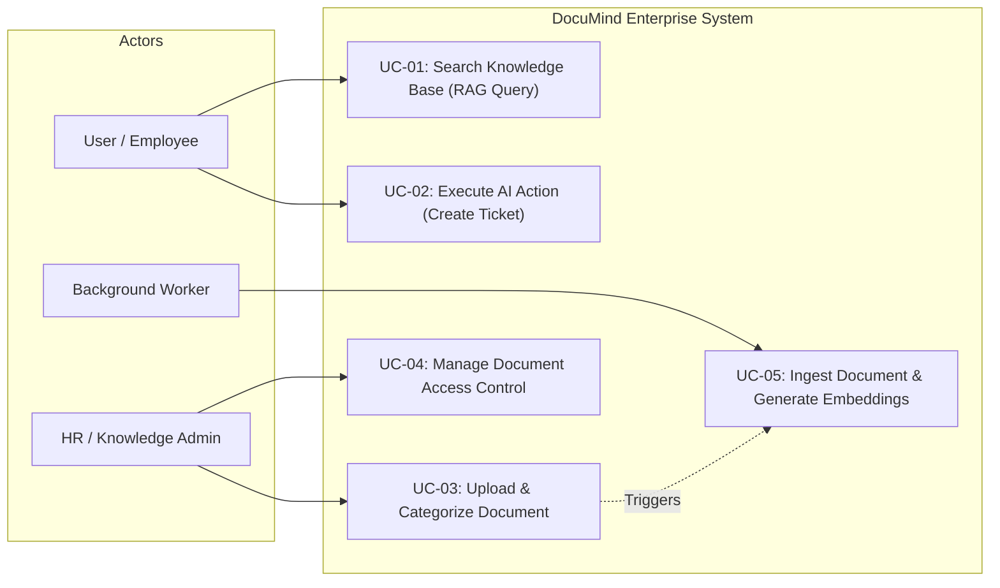
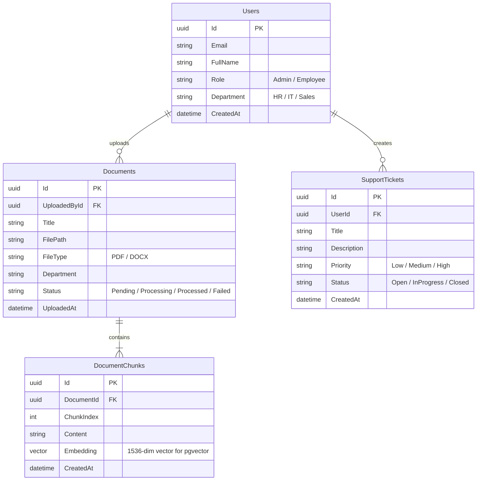
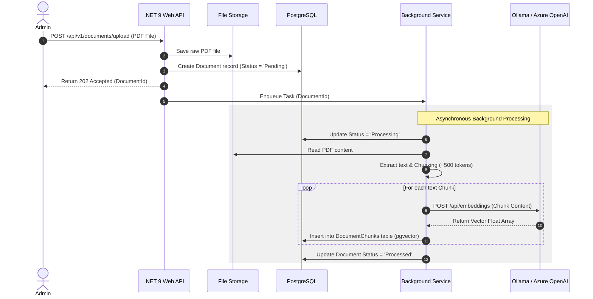
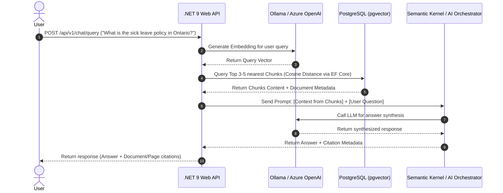
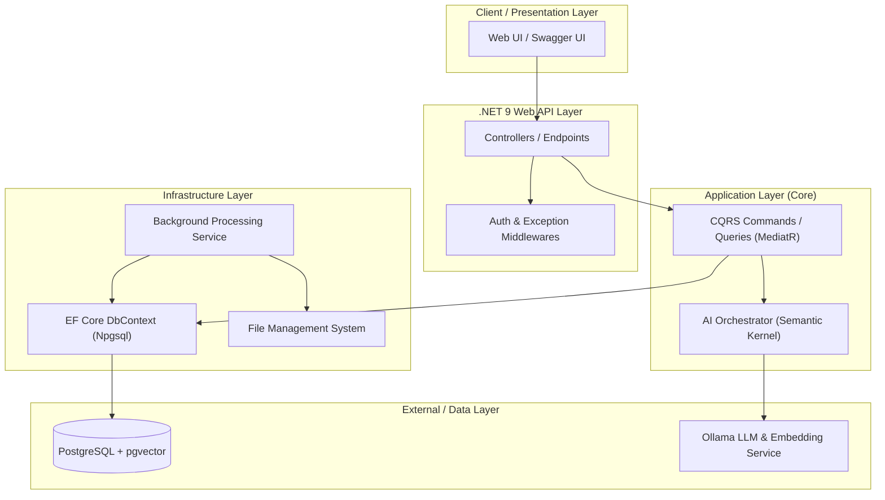

 # DocuMind Enterprise 🚀

> **Enterprise AI Agent Platform for Internal Knowledge Base & Automation**
> Built with .NET 9, PostgreSQL + pgvector, Clean Architecture, and AI Integration.

## 📌 Features
- **Smart Knowledge Base (RAG):** Upload PDF/Word documents and perform semantic search.
- **AI Action Agent:** Automate business tasks (e.g., Support Ticket creation) via .NET APIs.
- **Clean Architecture & CQRS:** Enterprise-grade design using .NET 9 & MediatR.

## 📐 Architecture & Design
### Use Case Diagram

### ERD

### Sequence Diagram: Document Ingestion Flow

### Sequence Diagram: RAG Search Flow

### System Architecture

